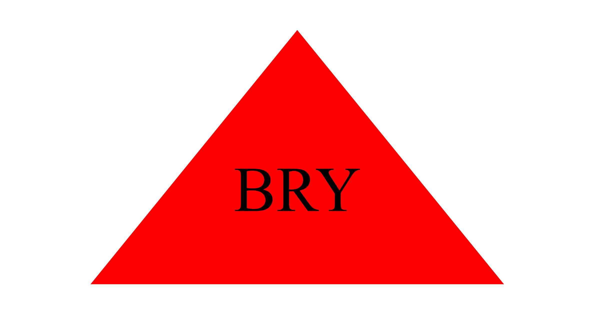

# SVG_LogoMaker

## Description:
AS a freelance web developer
I WANT to generate a simple logo for my projects using the CLI
SO THAT I don't have to pay a graphic designer

- What did you learn?

## Table of Contents:

- [Installation](#installation)
- [Usage](#usage)
- [Credits](#credits)
- [License](#license)

## Installation:
1. Clone the repository: [https://github.com/britt-young/SVG_LogoMaker](https://github.com/britt-young/SVG_LogoMaker)
2. Install the following:
* Node.JS Version 16.18.1
* Jest Version 29.4.3
* Inquirer.js: Version 8.2.4
3. Open the cloned repository in any source code editor
4. Open the integrated terminal for the document and complete the installation guides provided in step 2

## Usage:
1. Open the cloned repository in any source code editor (e.g. Visual Studio Code)
2. Open integrated terminalfrom the index.js file
3. Enter the command “node index.js” in the command line interface/ terminal
4. Through sequential order within the command line interface - the user will be presented with npm inquirer questions - the user will provide a response to each question and proceed
5. Once completed an SVG file named "logo.svg" will be created in the "examples" folder
6. User may rename the "logo.svg" file to the file name of their choice

    

## Credits:

* [Node.js](https://nodejs.org/en/blog/release/v16.18.1/)
* [Jest](https://www.npmjs.com/package/jest)
* [Inquirer.js](https://www.npmjs.com/package/inquirer/v/8.2.4)
* [Jest Crash Course Tutorial- Traversy Media](https://www.youtube.com/watch?v=7r4xVDI2vho)

## License

n/a

## Tests
[APP DEMO VIDEO](https://drive.google.com/file/d/1PslQM5HTdn5VUKcjJuaDykKRxH6U-6_Z/view) 
* Tests are conducted using Jest through the command "npm test" in the terminal
* The shapes.test.js file can be found in the lib folder
* Each shape has a specific test, for a total of 3 tests
* Test status: 1 PASS (square), 2 FAIL (circle, triangle)